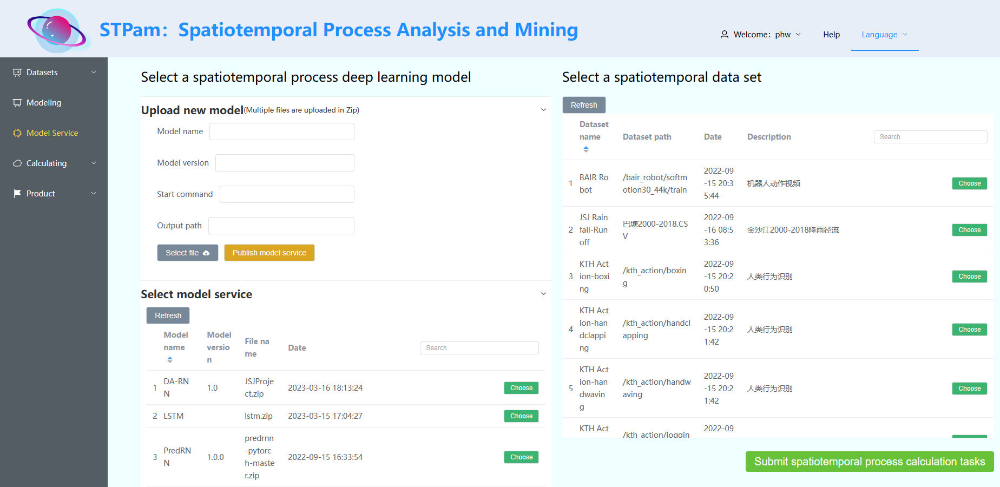
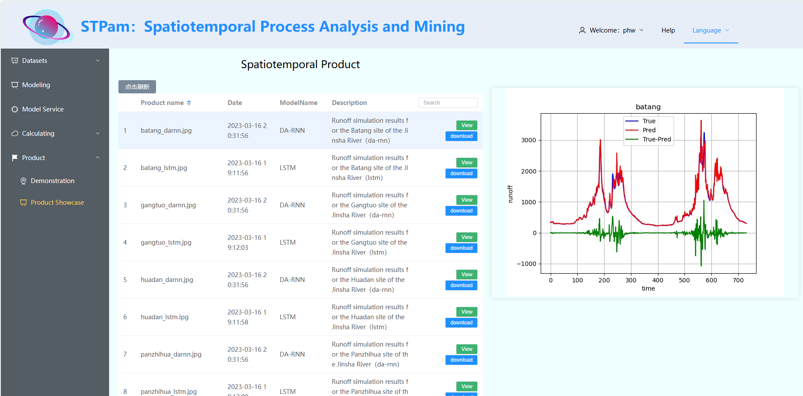

# **STPam**

## **Introduction**

### **STPam: Spatiotemporal processes analysis and mining**

STPam is developed under the leadership of Professor Zeqiang Chen from the National Geoinformation System Engineering Technology Research Center at China University of Geosciences (Wuhan). It is supported by the National Key Research and Development Program(2021YFF0704400). STPam focuses on the impact of spatiotemporal process analysis and mining in areas such as natural disaster evolution, environmental pollution, and human behavior prediction.

Considering the diverse sources of spatio-temporal process data, the dynamic nature of spatio-temporal objects, and the complexity of model structures, STPam features dynamic adaptation of data sources, plug-and-play deep learning models, and distributed framework with collaborative data processing. It is compatible with mainstream deep learning frameworks and provides user-friendly online modeling services.


The architecture of the STPam system is shown in the following diagram,


It mainly consists of four modules:

1. Front-end interaction layer: Provides visualization training for spatio-temporal processes and demonstrates the application of flood disaster in the middle reaches of the Yangtze River (under research).
2. Microservice business layer: Microservices for managing multi-source big data, plug-and-play deep learning models, distributed analysis and mining, spatio-temporal product display, secure access and authorization, service registration and discovery, load balancing, and other non-business logic.
3. Distributed computing layer: Incorporates incremental learning (under research), multi-framework hybrid programming, and parallel distributed optimization computing for time-series data segmentation.
4. Multi-source data I/O layer: Provides methods for adapting, loading, and transforming multi-source spatio-temporal data.

Front-end：Vue，Axios，ElementPlus

Back-end：SpringCloud, SpringBoot, SpringSecurity


## **Quick Start**

##### Website: http://stpam.chenzeqiang.top:8070

##### or：http://47.92.157.59:8070


## **Install**

### 1. Install STPam using Docker image

*<u>**Python and distributed environment have been encapsulated, no additional configuration is required**</u>*

##### search Docker image of STPam

```shell
docker search STPam
```

##### pull image

```shell
docker pull STPam
```

##### start docker container

（front-end port: 8070，back-end port: 8081）

```shell
docker run -it --gpus all -p 8070:8070 -p 8081:8081 --name stpam -e NVIDIA_DRIVER_CAPABILITIES=compute,utility -e NVIDIA_VISIBLE_DEVICES=all -d STPam
```

##### connect to gpu in the server

```shell
docker run -it --rm --gpus all ubuntu nvidia-smi
```

the figure below indicates the success connection to gpu in the server


##### enter docker container

```shell
docker exec -it stpam /bin/bash
```

##### start front-end and back-end

```shell
//front-end
cd /mnt/stpam/front
npm run dev

//back-end
cd  /mnt/stpam/back
java -jar stpam-v1.jar
```

##### running

```url
http://local ip:8070
```


### 2. Install STPam using source code compilation

##### environment preparation

The following table lists the system environment and third-party dependencies required for compiling and installing STPam

| Name         | Version     | Function                                              |
| ------------ | ----------- | ----------------------------------------------------- |
| PyTorch      | 1.12.1      | PyTorch  framework                                    |
| TensorFlow   | 2.12.0      | TensorFlow framework                                  |
| PaddlePaddle | 2.4.2       | PaddlePaddle framework                                |
| LuoJiaNET    | 1.0.0       | LuoJiaNET framework                                   |
| Cuda         | 11.3        | Nvidia general parallel computing architecture (GPU)  |
| Anaconda     | 3           | Virtual environment for python                        |
| Python       | 3.8         | Distributed computing framework language              |
| Nccl         | 2.10.3      | Nvidia collective communication library               |
| OpenMPI      | 4.0.3       | Multi-process communication library used by LuoJiaNET |
| node.js      | 16.17.0     | Front-end framework                                   |
| jdk          | 1.8         | Java development kit                                  |
| git          |             | Source code management tool of STPam                  |
| ubuntu       | 20.04.1     | Linux operation system                                |
| gcc          | 7.5 ~ 9.4.0 | GNU Compiler Collection                               |

##### download source code

url：http://47.92.157.59:8090/panhuiwen/stpam

##### start

```shell
//front-end
cd /stpam/front
npm run dev

//back-end
cd  /stpam/back
java cvf back.jar back
java -jar back.jar
```

##### running

```shell
http://local ip:8070
```

## **Spatiotemporal process analysis and mining**

### Multi-source spatiotemporal data

*data view、upload local data、adapt multi-source databases and hdfs*


##### data viewing

Include data name, description, upload date, and details

##### upload local dataset

Click Select Local Data to read the local file directory, select the data to be uploaded, and click Upload to the server to push the data to the hdfs server for storage.

##### adapt multi-source databases and hdfs

It is applicable to relational databases, non-relational databases, and hdfs.

Enter the data source id, host, database name, username, and password to pull the target data.


adapt mysql and hdfs：


Obtaining external data succeeded. 


### Modeling online

Deep learning model file structure analysis, real-time update


### Publish spatiotemporal process calculation mission

1. Upload new models and publish them as services

2. Select existing model services and data sets, and publish spatio-temporal process analysis mining tasks



### Efficient computation of spatiotemporal processes

1. Distributed computing

Select the deep learning framework suitable for the model, call the distributed API to complete the distributed analysis mining task of the spatio-temporal process, and display the model training process and GPU status

2. Incremental Learning (in progress)

Real-time data combined with historical data learning features to accelerate spatiotemporal process model training


### Product demonstration

1. Flood Demonstration and Application in the Middle reaches of the Yangtze River (under study)

2. Visualization of space-time process computing products



## **Software features are still being improved**


## **Contact us**

E-mail: chenzeqiang@cug.edu.cn，phw1220@cug.edu.cn

