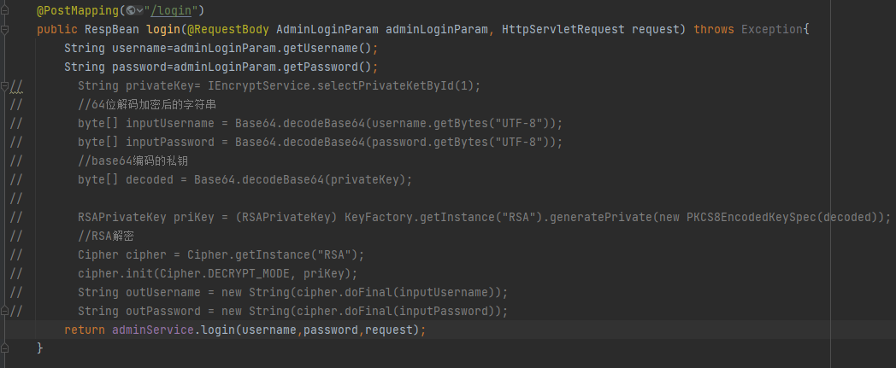
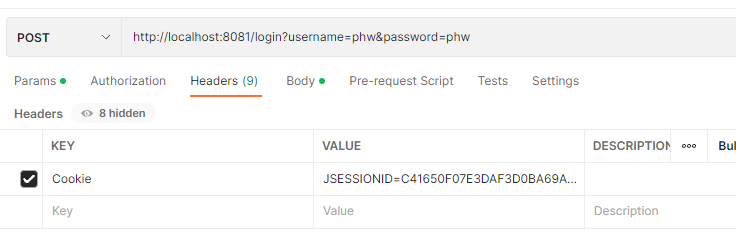
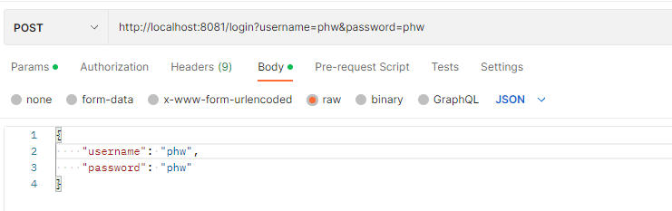

# 目录结构
/generator：mybatis逆向工程，快速生成pojo、mapper等文件夹和文件
/server：核心文件
    ./java
        ./config：springsecurity、jwt和swagger
            ./security：核心配置文件，包括ss和jwt授权登录和错误返回提示等
        ./controller：功能实现
            ./admin：用户登录注册及信息加密
            ./computing：分布式计算
            ./dataset：数据集
            ./datasource：多源数据库
            ./deepModel：时空过程模型相关操作
            ./hdfs：hadoop文件管理系统
            ./setting：软件设置相关
        ./mapper：可编写sql
        ./pojo：实体类
        ./service：实现类
    ./resources
        ./config：yml配置文件
        ./files：本地存储的模型文件
        ./mapper：通用查询文件

# 技术栈
开发框架：SpringMVC、SpringBoot
安全登录授权：SpringSecurity、JWT
数据库：MybatisPlus、lombok、mysql、hutool
数据源：Druid、DynamicDatasource
分布式文件管理：hdfs

# Postman测试接口
1.在LoginController的login方法中注释Encrypt相关代码，
  return中直接返回adminLoginParam的username和password

2.将网页登录成功后的Cookies复制，放在Postman的Headers

3.在Postman的Body选择raw和JSON格式，编写默认的username和password

